# Dev Enviroment Setup Guide

This is a guide to help you set up your devlopment environment.

 <!-- 调整间距大小 -->

# IDE

If the EN version not available,  try translating the page to English

#### DevEco Studio

According to [OpenHarmony/docs on Gitee](https://gitee.com/openharmony/docs/blob/master/zh-cn/release-notes/OpenHarmony-v4.1-release), the latest release :DevEco Studio 4.1

[Windows(64-bit)](https://gitee.com/link?target=https%3A%2F%2Fcontentcenter-vali-drcn.dbankcdn.cn%2Fpvt_2%2FDeveloperAlliance_package_901_9%2Fee%2Fv3%2FHqJ-6O2FQny86xtk_dg9HQ%2Fdevecostudio-windows-4.1.0.400.zip%3FHW-CC-KV%3DV1%26HW-CC-Date%3D20240409T033730Z%26HW-CC-Expire%3D315360000%26HW-CC-Sign%3DBFA444BC43A041331E695AE2CFA9035A957AF107E06C97E793FD3D31D7096A0D)

SHA256：c46be4f3cfde27af1806cfc9860d9c366e66a20e31e15180cf3a90ab05464650

[Mac(X86)](https://gitee.com/link?target=https%3A%2F%2Fcontentcenter-vali-drcn.dbankcdn.cn%2Fpvt_2%2FDeveloperAlliance_package_901_9%2F3b%2Fv3%2FJgGp8n0bShOkm1MpBFJ73w%2Fdevecostudio-mac-4.1.0.400.zip%3FHW-CC-KV%3DV1%26HW-CC-Date%3D20240409T034037Z%26HW-CC-Expire%3D315360000%26HW-CC-Sign%3D35C1F8B3FC19325EBBC32D8E11106DDB074A8ECC6BB3A77FF2EADBA2A8A223DA)

SHA256：15d6136959b715e4bb2160c41d405b889820ea26ceadbb416509a43e59ed7f09

[Mac(ARM)](https://gitee.com/link?target=https%3A%2F%2Fcontentcenter-vali-drcn.dbankcdn.cn%2Fpvt_2%2FDeveloperAlliance_package_901_9%2F21%2Fv3%2FD7Jy1StbTwSLUXaA20VrAw%2Fdevecostudio-mac-arm-4.1.0.400.zip%3FHW-CC-KV%3DV1%26HW-CC-Date%3D20240409T034235Z%26HW-CC-Expire%3D315360000%26HW-CC-Sign%3D19598AAC650D2AB24CAC6DFDF0DBD312188FB0438A8233B7687E6ACDC43A51F8)

SHA256：ac04ca7c2344ec8f27531d5a59261ff037deed2c5a3d42ef88e6f90f4ed45484

 <!-- 调整间距大小 -->

# Documentation

[API Reference  (openharmony.cn)](https://docs.openharmony.cn/pages/v4.0/en/application-dev/reference/apis/development-intro.md)    
(check out all API Reference on the left sidebar)

English documentation of Application Development   
[Overview of ArkTS Common Library (openharmony.cn)](https://docs.openharmony.cn/pages/v4.0/en/application-dev/arkts-utils/arkts-commonlibrary-overview.md)  
[en/application-dev/Readme-EN.md · OpenHarmony/docs \- Gitee.com](https://gitee.com/openharmony/docs/blob/master/en/application-dev/Readme-EN.md)

More info on [Gitee repository of  OpenHarmony](https://gitee.com/openharmony) 

 <!-- 调整间距大小 -->

# Full SDK & Public SDK

According to the documentation there is two types of SDKs:

* Public-SDK: A toolkit provided for application development. It is available for download with DevEco Studio and does not include high-permission APIs required for system applications.  
* Full-SDK: A toolkit provided for OEM manufacturers to develop applications. It cannot be downloaded with DevEco Studio and includes high-permission APIs required for system applications.

## How to get the Full SDK?

### Approach 1: From CICD pipeline (Recommended)

#### Get the Full SDK

1. Obtain the latest OpenHarmony SDK from the OpenHarmony daily build pipline [Daily Build | OpenHarmony CI](https://ci.openharmony.cn/workbench/cicd/dailybuild/dailylist). The daily build pipeline builds system images, SDKs, etc.  
   
   User conditional filtering, such as selecting the target branch OpenHarmony-4.0-Release, selecting a date from the previous month, or manually choosing a range.  
   
   In the daily build or rolling build, find ohos-sdk-full, and click on the download link to choose and download the full package, which includes Full-SDK for Windows and Linux.  (If daily build SDK is not compatible with your version of DevEco Studio, try to use rolling build SDK instead)
   
   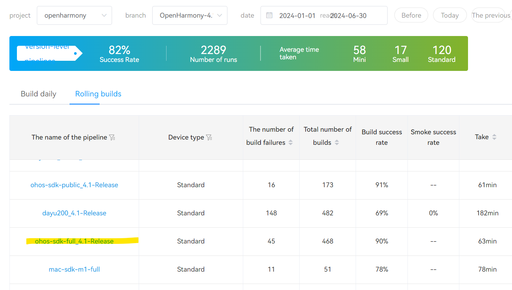

| pipeline        | description                                                                                          | remark                                                                                                           |
| --------------- | ---------------------------------------------------------------------------------------------------- | ---------------------------------------------------------------------------------------------------------------- |
| ohos-sdk-public | The public SDK is available for Linux and Windows platforms                                          | It is provided for application developers and does not include system interfaces that require system permissions |
| mac-sdk-public  | The public SDK for macOS is available                                                                | It is provided for application developers and does not include system interfaces that require system permissions |
| ohos-sdk-full   | Applicable to Linux and Windows platforms. If you want to use system APIs, you need to use this SDK. | Available to OEMs, including system interfaces that require access to the system                                 |
| mac-sdk-full    | Full SDK for macOS. If you want to use system APIs, you need to use this SDK.                        | Available to OEMs, including system interfaces that require access to the system                                 |

2. Make sure that the downloaded SDK is the full SDK.  
   Check whether the downloaded file name contains "full-SDK."  
   Check if the API includes system APIs such as @ohos.app.ability.abilityManager.d.ts, @ohos.app.form.formInfo.d.ts, and @ohos.bluetooth.d.ts,   
   (check documentation for more system APIs)  

#### Replace the Full SDK

Take the replacement of the full SDK of DevEco Studio 4.0-Beta1, API 10 on Windows OS as an example.

1. Backup and remove the local SDK:  
   Make sure to select OpenHarmony then navigate to the directory where the original SDK is installed.
   
   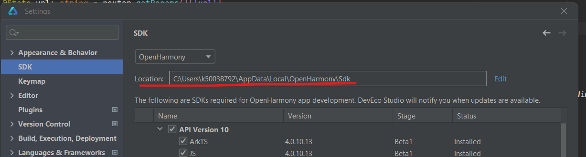

Copy the entire SDK directory (e.g., 10) to another location on your system where you want to keep the backup.

Now you can remove the original SDK from its directory.

1. The SDK you have acquired needs to be recognized by DevEco Studio in order to be used. For example, with the daily build SDK : ersion-Daily\_Version-ohos-sdk-public-20230716\_020117-ohos-sdk-public.tar.gz, the compressed file has the following directory structure. You can see that it contains SDK files for both Linux and Windows platforms. Each platform's SDK includes directories such as ets, js, native, previewer, and toolchains.
   
   └─version-Daily\_Version-ohos-sdk-public-20230716\_020117-ohos-sdk-public
   
       │  daily\_build.log
       
       │  manifest\_tag.xml
       
       │
       
       └─ohos-sdk
       
           ├─linux
       
           │      ets-linux-x64-4.0.9.3-Beta2.zip
       
           │      js-linux-x64-4.0.9.3-Beta2.zip
       
           │      native-linux-x64-4.0.9.3-Beta2.zip
       
           │      previewer-linux-x64-4.0.9.3-Beta2.zip
       
           │      toolchains-linux-x64-4.0.9.3-Beta2.zip
       
           │
       
           └─windows
       
                   ets-windows-x64-4.0.9.3-Beta2.zip
       
                   js-windows-x64-4.0.9.3-Beta2.zip
       
                   native-windows-x64-4.0.9.3-Beta2.zip
       
                   previewer-windows-x64-4.0.9.3-Beta2.zip
       
                   toolchains-windows-x64-4.0.9.3-Beta2.zip

2. Create a new directory with the API version 10  as the file name in dir path: xxx\\SDK\\ , unzip the compressed files  into this directory to form a structure below:
   
   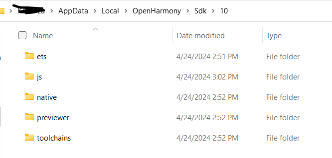

3. Install node\_modules Dependencies:  
   Under the following two paths:  
   xxx\\SDK\\10\\ets\\build-tools\\ets-loader  
   xxx\\SDK\\10\\js\\build-tools\\ace-loader  
   Open the terminal and **“npm install”** to update the missing dependencies.  

4. Verify in the IDE:  
   Full API will be loaded in IDE and you can now rebuild the project.  
   
   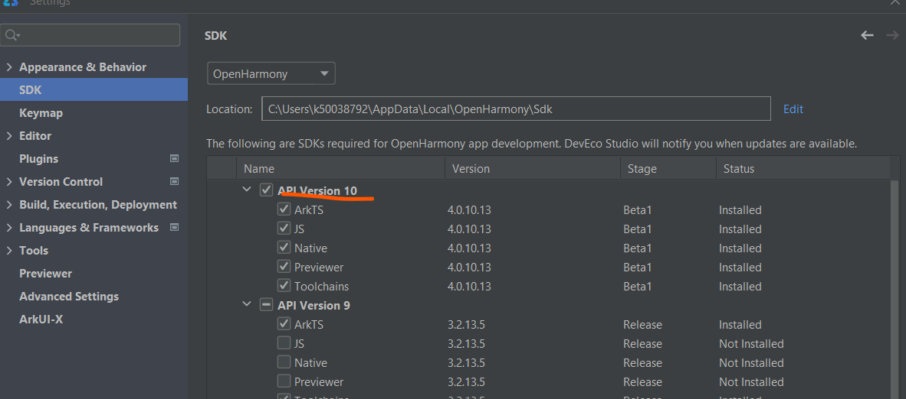

### Approach 2: From Compiled Source Files**

The Full-SDK is not available directly. It can be compiled from the source code of OpenHarmony and manually replaced in DevEco Studio. The method of replacing the SDK is the same as the one mentioned in Approach 1.

You can find the guide  of compilation of source code here: [How to compile Full SDK](https://gitee.com/openharmony/docs/blob/OpenHarmony-3.2-Release/zh-cn/application-dev/quick-start/full-sdk-compile-guide.md#%E7%BC%96%E8%AF%91full-sdk)

Please use translation tools if needed.

 <!-- 调整间距大小 -->

# Developer Account

Introduction of Register and Identify Verification:  
[HUAWEI ID Registration-Registration and Verification | HUAWEI Developers](https://developer.huawei.com/consumer/en/doc/start/registration-and-verification-0000001053628148)

In simple terms, anyone can register for an individual developer account, whether they choose to verify their identity or not.  However, it's said that certain permissions require an identity verification with the identity document. 

According to information from the Huawei developer forum, verified developers gain access to more development resources, training materials, and market promotion. Moreover, only verified developers are allowed to publish applications.

Enterprise developers receive a broader range of services compared to individual developers. Here's a breakdown:

* Individual Developers: App Market, Themes, Product Management, Account, PUSH, New Game Pre-order, Interactive Comments, Social, HUAWEI HiAI, Watch App Market, etc.  

* Enterprise Developers: App Market, Themes, Initial Release, Payment, Game Packages, App Market Promotion, Product Management, Games, Account, PUSH, New Game Pre-order, Interactive Comments, Social, HUAWEI HiAI, Watch App Market, Sports & Health, Cloud Testing, Smart Home, etc.

For application development, a developer account is not necessary.   
For testing and debugging,If you want to debug with the development board, it is necessary to generate a signature for the project. You need first sign in your  HUAWEI Developers for generating one.

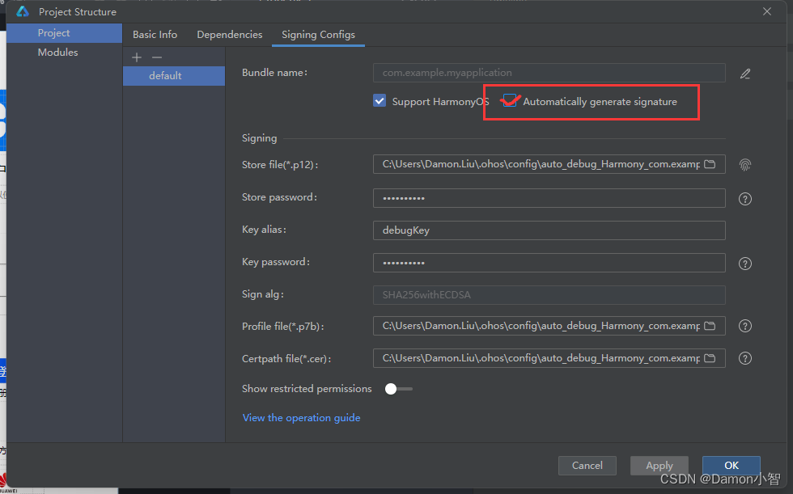

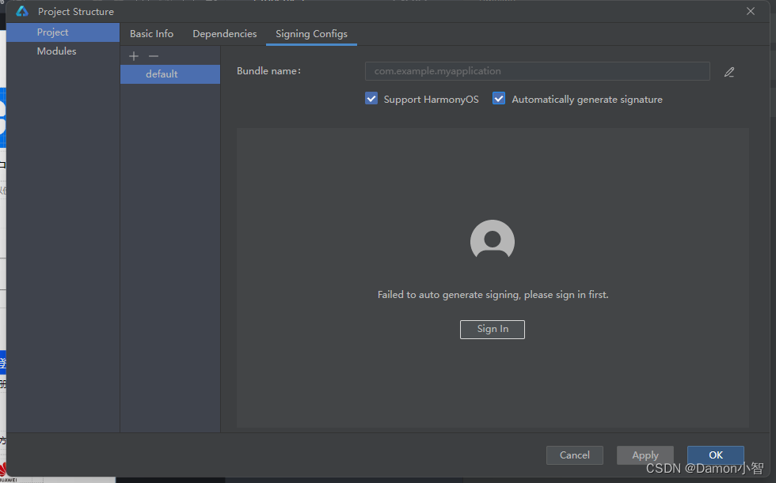

 <!-- 调整间距大小 -->

# OHPM

OHPM (OpenHarmony Package Manager) is a package management system designed for OpenHarmony, providing access to third-party libraries and tools that enhance development efficiency and functionality within the OpenHarmony ecosystem. (Think of it as NPM in openharmony)

[OpenHarmony Third Party Repository](https://ohpm.openharmony.cn/\#/cn/home) 

Some examples of library：

1. **ohos\_axios**: A promise-based network request library that can run on Node.js and browsers, and is adapted for OpenHarmony.  
2. **socket.io**: A library for implementing low-latency, bidirectional communication between clients and servers, supporting WebSocket protocol.  
3. **mars**: A cross-platform network component library that provides solutions for long and short network connections.  
4. **httpclient**: An efficient HTTP client for OpenHarmony that supports various protocols and optimizes network transmission.

 <!-- 调整间距大小 -->

# Issues and Solutions

## Installation Failure After Project Creation

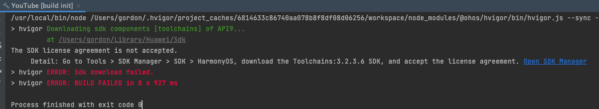
There are a bunch of solutions on the forum but I simply tried switching the intranet to Internet.

##### 

## SDK Download Failed

During the build process, an error message indicating "SDK download failed" may appear. However, the Toolchain in the error message does not exist in SDK manager.  
   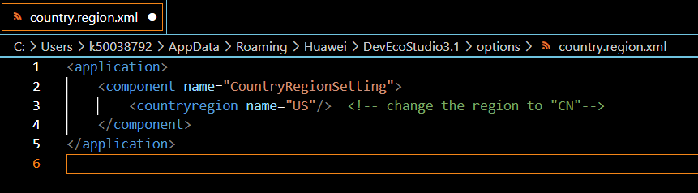
The reason is likely that you are not in China. (This is weird though.)  
Try navigating to the path on Windows  
*C:\\Users\\username\\AppData\\Roaming\\Huawei\\DevEcoStudio3.0\\options*   
(on MacOS it's   
*/Users/username/Library/Application Support/Huawei/DevEcoStudio3.0/options*), open country.region.xml, and modify *countryregion* name to 'CN'

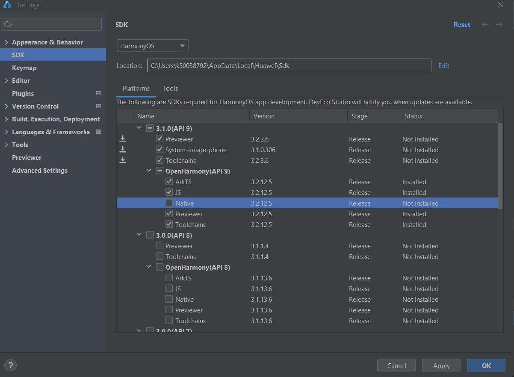

After saving your changes, SDK 3.2 should be loaded in SDK Manager. Proceed to download all selected SDKs for API9. Click "Apply" to confirm the selection. Agree to all license agreements and download the selected SDKs. Once the download is complete, click "Finish". Afterward, rebuild the project. You should see a successful compilation.

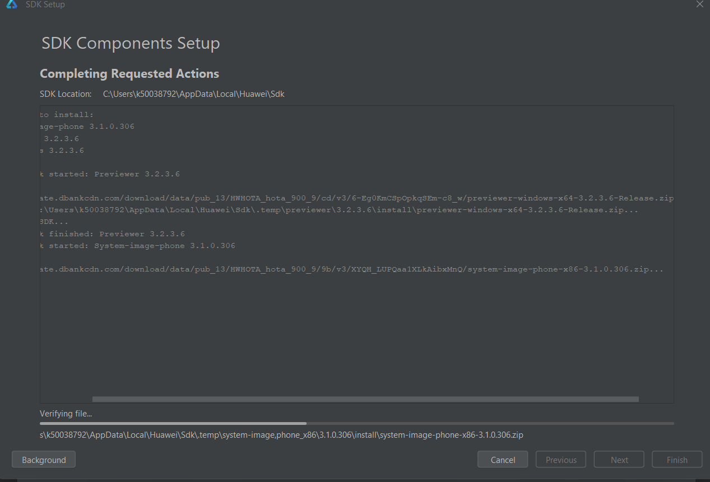

## Cannot find the emulator of a phone device

entry\>src\>main\>module.json5 is the configuration file for the module, check deviceType, add 'phone' if the it is missing.

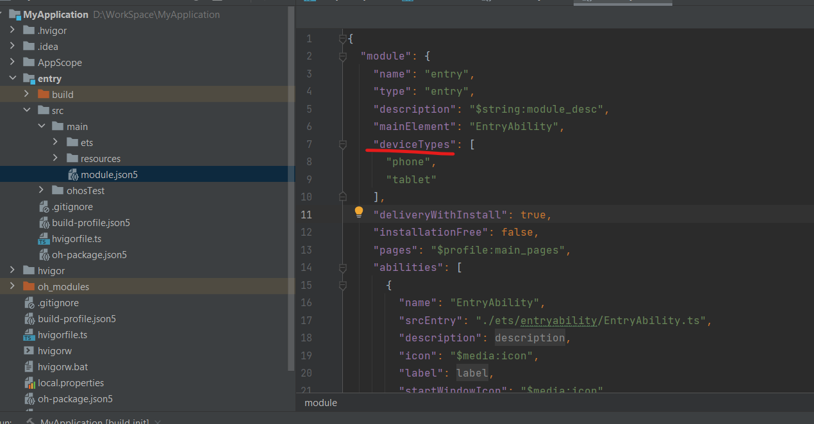

## Unable to find BMS Service when running on Emulator

Just wait for an extended period, or try clearing data of this device or creating a new device.

## Unstable USB connection, dev board not detected by IDE**

solution worked for me:  

Change USB Power Management Settings

1. Search for and open *Device Manager*.  
2. Click to expand *Universal Serial Bus Controllers*.  
3. Right-click on *USB Root Hub* and select *Properties*.  
4. Uncheck *Power Management* and click *OK*.

    <figure >
        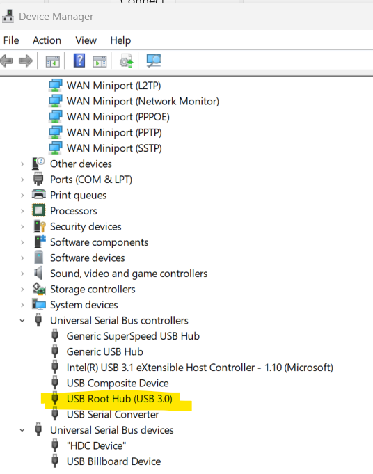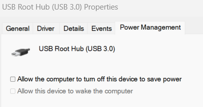
    </figure>

#### 

## compileSdkVersion and releaseType of the app do not match the apiVersion and releaseType on the device

Reason: The compiled SDK version is higher than the actual device.

Solution:  
Step 1: Modify build\_profile.json5 under entry and set apiType to faMode.  
Step 2: Modify build\_profile.json5 under the project, change the compiled version to a lower version.  
Run again, and the problem will be resolved.  
   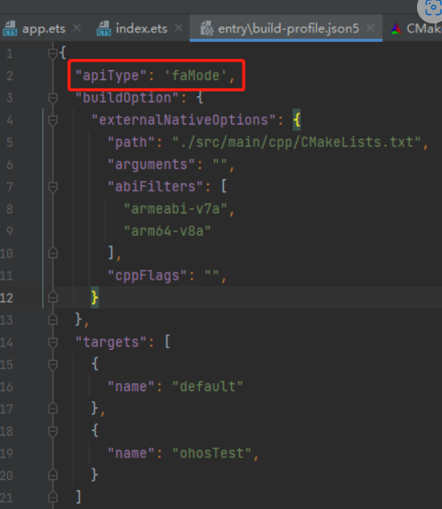

## Install Failed

Have the device connected and detected by IDE, click on “run”, the IDE gives the error messages:   
"Install Failed : failed to install bundle. code: 9568289, error: install failed due to grant request permissions failed."  

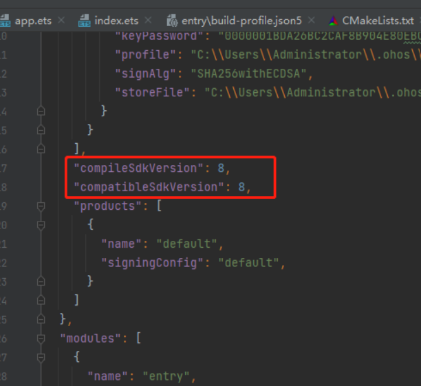

It should be a permission issue, and now we need to identify the permissions causing the problem.   

[This documentation](https://gitee.com/openharmony/resources/blob/master/systemres/main/config.json) lists all permissions and their levels in OpenHarmony. 

There are three types of permissions used in OpenHarmony for requests, ordered from low to high: normal, system\_basic, system\_core.

If the permission level is set to "availableLevel": "system\_basic", then you need to configure the acls field in the UnsignedReleasedProfileTemplate.json file and include the required high-level permissions in acls. The specific steps are as follows:

set the"profile" with p7b file generated from java \-c commands in build-profile.json5  

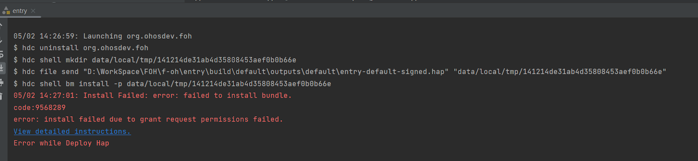

# 
