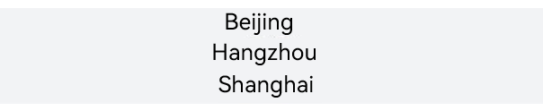
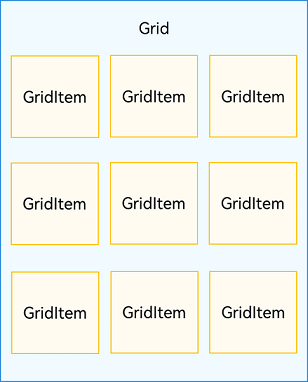

# List and Grid Component

- [List Component](#list-component)  
    - [Layout](#layout)  
    - [Display data in List](#display-data-in-list)  
    - [Iterating list content](#iterating-list-content)  
    - [Customizing the list style](#customizing-the-list-style)  
        - [Setting the spacing](#setting-the-spacing)  
        - [Adding Dividers](#adding-dividers)  
        - [Adding a Scrollbar](#adding-a-scrollbar)  
    - [demo]()  
    - [More information](#more-information)
- [Grid Component](#grid-component)  
    - [Layout](#layout-1)  
    - [Display data in Grid](#display-data-in-grid)  
    - [Iterating grid content](#iterating-grid-content)  
    - [Setting the Arrangement Mode](#setting-the-arrangement-mode)  
        - [Setting the Number and Proportion of Rows and Columns](#setting-the-number-and-proportion-of-rows-and-columns)  
        - [Setting the Number of Rows and Columns Occupied by a Child Component](#setting-the-number-of-rows-and-columns-occupied-by-a-child-component)  
        - [Setting the Main Axis Direction](#setting-the-main-axis-direction)  
    - [demo]()  
    - [More information](#more-information-1)  

## List Component

In typical mobile applications, list is very common and basic component. For example, we can find list in settings page, contact book, and product catalogs.

The **List** component supports the generation of child components in various rendering modes like conditional rendering and rendering of repeated content.

### Layout

A list automatically arranges child components in the direction it scrolls. Adding or removing child components from the list will trigger re-arrangement of the child components.

As shown in the following figure, in a vertical list, **ListItemGroup** or **ListItem** components are automatically arranged vertically.

**ListItemGroup** is used to display list data by group. Its child component is also **ListItem**. **ListItem** represents a list item, which can contain a single child component.

  **Figure 1** Relationships between **List**, **ListItemGroup**, and **ListItem** 

<div style="text-align:center">
    
</div>

>**NOTE**
>
>A **List** component can contain only **ListItemGroup** or **ListItem** as its child components. **ListItemGroup** and **ListItem** must be used together with **List**.

### Display data in List  

The list displays a collection of items horizontally or vertically and can scroll to reveal content off the screen. In the simplest case, a **List** component is statically made up of **ListItem** components.

  **Figure 2** Example of a city list 

<div style="text-align:center">
    
</div>

```ts
@Entry
@Component
struct CityList {
  build() {
    List() {
      ListItem() {
        Text('Beijing').fontSize(24)
      }

      ListItem() {
        Text('Hangzhou').fontSize(24)
      }

      ListItem() {
        Text('Shanghai').fontSize(24)
      }
    }
    .backgroundColor('#FFF1F3F5')
    .alignListItem(ListItemAlign.Center)
  }
}
```

Each **\<ListItem>** component can contain only one root child component. Therefore, it does not allow for child components in tile mode. If tile mode is required, encapsulate the child components into a container or create a custom component.

  **Figure 3** Example of a contacts list 

<div style="text-align:center">
    
</div>

As shown above, as a list item, each contact has a profile picture and a name. To present it, you can encapsulate **Image** and **Text** components into a **Row** container.


```ts
List() {
  ListItem() {
    Row() {
      Image($r('app.media.iconE'))
        .width(40)
        .height(40)
        .margin(10)

      Text ('Tom')
        .fontSize(20)
    }
  }

  ListItem() {
    Row() {
      Image($r('app.media.iconF'))
        .width(40)
        .height(40)
        .margin(10)

      Text ('Tracy')
        .fontSize(20)
    }
  }
}
```

### Iterating List Content
Compared with a static list, a dynamic list is more common in applications. You can use **ForEach** to obtain data from the data source and create components for each data item.

For example, when creating a contacts list, you can store the contact name and profile picture data in a **Contact** class structure to the **contacts** array, and nest **ListItems** in **ForEach**, thereby reducing repeated code needed for tiling similar list items.

```ts
import util from '@ohos.util';

class Contact {
  key: string = util.generateRandomUUID(true);
  name: string;
  icon: Resource;

  constructor(name: string, icon: Resource) {
    this.name = name;
    this.icon = icon;
  }
}

@Entry
@Component
struct SimpleContacts {
  private contacts: Array<object> = [
    new Contact ('Tom', $r("app.media.icon_user1")),
    new Contact ('Tracy', $r("app.media.icon_user2")),
  ]

  build() {
    List() {
      ForEach(this.contacts, (item: Contact) => {
        ListItem() {
          Row() {
            Image(item.icon)
              .width(40)
              .height(40)
              .margin(10)
            Text(item.name).fontSize(20)
          }
          .width('100%')
          .justifyContent(FlexAlign.Start)
        }
      }, (item: Contact) => JSON.stringify(item))
    }
    .width('100%')
  }
}
```

You can get the icons used in above example here: [icon_user1](./images/icon_user1.png), [icon_user2](./images/icon_user2.png), download and put them into your project under the following path:
`Your project` -> `entry` -> `src` -> `main` -> `resources` -> `base` -> `media`.
<div style="text-align:center">
    
</div>

The effect is drawing as follows:

<div style="text-align:center">
    
</div>

### Customizing the List Style
#### Setting the Spacing
When initializing a list, you can use the **space** parameter to add spacing between list items. In the following example, a 10vp spacing is added between list items along the main axis:


```ts
List({ space: 10 }) {
  // ...
}
```

#### Adding Dividers
A divider separates UI items to make them easier to identify. 

To add dividers between list items, you can use the **divider** attribute together with the following style attributes:<br> **strokeWidth** and **color**: stroke width and color of the diver, respectively.

**startMargin** and **endMargin**: distance between the divider and the start edge and end edge of the list, respectively.

The following example draws a divider with a stroke thickness of 1 vp from a position 60 vp away from the start edge of the list to a position 10 vp away from the end edge of the list. 

```ts
class DividerTmp {
  strokeWidth: Length = 1
  startMargin: Length = 60
  endMargin: Length = 10
  color: ResourceColor = '#ffe9f0f0'

  constructor(strokeWidth: Length, startMargin: Length, endMargin: Length, color: ResourceColor) {
    this.strokeWidth = strokeWidth
    this.startMargin = startMargin
    this.endMargin = endMargin
    this.color = color
  }
}

@Entry
@Component
struct EgDivider {
  @State egDivider: DividerTmp = new DividerTmp(1, 60, 10, '#ff0da2a2')
  private numList: number[] = [0, 1, 2, 3, 4, 5]

  build() {
    List() {
      ForEach(this.numList, (item: number) => {
        ListItem() {
          Row() {
            Text(`${item}`)
          }
          .width('100%')
          .justifyContent(FlexAlign.Center)
        }
      })
    }
    .divider(this.egDivider)
  }
}

```
The effect is drawing as follows:

  **Figure 4** Using dividers between the list items 

<div style="text-align:center">
    
</div>

>**NOTE**
>
>1. The stroke width of the divider causes some space between list items. If the content spacing set for the list is smaller than the stroke width of the divider, the latter is used instead.
>
>2. When a list contains multiple columns, the **startMargin** and **endMargin** attributes of the divider apply to each column.
>
>3. The divider is drawn between list items. No divider is drawn above the first list item and below the last list item.

#### Adding a Scrollbar
When the total height (width) of list items exceeds the screen height (width), the list can scroll vertically (horizontally). The scrollbar of a list enables users to quickly navigate the list content, as shown below.

  **Figure 5** Scrollbar of a list

<div style="text-align:center">
    
</div>

When using the **List** component, you can use the **scrollBar** attribute to control the display of the list scrollbar. The value type of **scrollBar** is **BarState**. When the value is **BarState.Auto**, the scrollbar is displayed as required: It is displayed when the scrollbar area is touched and becomes thicker when being dragged; it automatically disappears after 2 seconds of inactivity.

The default value of the **scrollBar attribute** is **BarState.Off** in API version 9 and earlier versions and **BarState.Auto** since API version 10.
```ts
List() {
  // ...
}
.scrollBar(BarState.Auto)
```

### More Information
You can find more details about **List** component from [this](https://github.com/eclipse-oniro-mirrors/docs/blob/OpenHarmony-4.1-Release/en/application-dev/ui/arkts-layout-development-create-list.md) source.

## Grid Component  
The **grid** layout consists of cells formed by rows and columns. You can specify the cells where items are located to create various layouts. The grid layout excels at dividing a page into regions and defining the proportion of child components. It is a key adaptive layout and applies to scenarios such as photo gallery, calendar, and calculator.

### Layout  
Each item in the **Grid** container corresponds to a **GridItem** component, as shown below.

**Figure 1** Relationship between **Grid** and **GridItem** components

<div style="text-align:center">
    
</div>

>**NOTE**
>
>The **Grid** component accepts only **GridItem** as its child.

### Display data in Grid

The grid layout organizes its internal elements in two-dimensional layout mode, as shown in the following figure.

**Figure 2** General office services 

<div style="text-align:center">
    
</div>

The **Grid** component can display a group of **GridItem** child components in two-dimensional layout mode.


```ts
Grid() {
  GridItem() {
    Text('Conference')
      ...
  }

  GridItem() {
    Text('Sign-in')
      ...
  }

  GridItem() {
    Text ('Vote')
      ...
  }

  GridItem() {
    Text ('Print')
      ...
  }
}
.rowsTemplate('1fr 1fr')
.columnsTemplate('1fr 1fr')
```

### Iterating Grid Content  
For multiple **GridItem** components with similar content structures, you are advised to nest them in **ForEach** statements to reduce repeated code. The effect is the same as above **figure 2**.

```ts
@Entry
@Component
struct OfficeService {
  @State services: Array<string> = ['Conference', 'Vote','Sign-in', 'Print']

  build() {
    Column() {
      Grid() {
        ForEach(this.services, (service:string) => {
          GridItem() {
            Text(service)
          }
        }, (service:string):string => service)
      }
      .rowsTemplate(('1fr 1fr') as string)
      .columnsTemplate(('1fr 1fr') as string)
    }
  }
}
```


######################################################
TO BE MANUALLY CHECK FROM [HERE](https://github.com/eclipse-oniro-mirrors/docs/blob/OpenHarmony-4.1-Release/en/application-dev/ui/arkts-layout-development-create-grid.md)

### Setting the Arrangement Mode
#### Setting the Number and Proportion of Rows and Columns

You can set the number and proportion of rows and columns to determine the overall arrangement mode of the grid layout. To do so, use the **rowsTemplate** and **columnsTemplate** attributes of the **\<Grid>** component.

The values of **rowsTemplate** and **columnsTemplate** are a string consisting of 'number+fr' segments, separated by spaces. Wherein **fr** indicates the number of rows or columns in the grid layout, and the number in front of **fr** is used to calculate the proportion of the row or column in the grid width, thereby determining the width of the row or column.

**Figure 3** Example of the proportion of rows and columns


The preceding figure shows a grid layout with three rows and three columns. The grid layout is divided into three parts in the vertical direction with each row taking up 1/3, and four parts in the horizontal direction with the first column taking up 1/4, the second column 2/4, and the third column 1/4.

This layout can be implemented by setting **rowsTemplate** to **'1fr 1fr 1fr'** and **columnsTemplate** to **'1fr 2fr 1fr'**.


```ts
Grid() {
  ...
}
.rowsTemplate('1fr 1fr 1fr')
.columnsTemplate('1fr 2fr 1fr')
```

>**NOTE**
>
>When **rowsTemplate** or **columnsTemplate** is set for the **\<Grid>** component, its **layoutDirection**, **maxCount**, **minCount**, and **cellLength** attributes do not take effect.

#### Setting the Number of Rows and Columns Occupied by a Child Component

In real-world applications, an uneven grid layout, where grid cells span a varying number of cells and rows, is as common as its even counterpart. To allow a single grid cell in a grid to span multiple rows or columns, passing appropriate [GridLayoutOptions](../reference/apis-arkui/arkui-ts/ts-container-grid.md#gridlayoutoptions10) when creating the grid. Use **irregularIndexes** and **onGetIrregularSizeByIndex** for grids with only **rowsTemplate** or **columnsTemplate**, and **onGetRectByIndex** for grids with both.

**Figure 4** Uneven grid layout


A common application with an uneven grid layout is the calculator. As shown in the following figure, the **0** key spans the first and second columns, and the **=** key spans the fifth and sixth rows. For a grid layout created using the **\<Grid>** component, the row and column numbers start from 0 and increase incrementally.

**Figure 5** Calculator 


In the grid, use the **onGetRectByIndex** callback to return the array [rowStart, columnStart, rowSpan, columnSpan] to achieve a layout that spans rows and columns, wherein **rowStart** and **rowEnd** indicate the start and end row numbers of the current element, and **columnStart** and **columnEnd** indicate the start and end column numbers of the current element.

To make the **0** key span across the first and second columns, and the **=** key span across the fifth and sixth rows, set **onGetRectByIndex** for **0** and **=** as follows: for **0**, set **rowStart** and **columnStart** at **5** and **0**, and **rowSpan** and **columnSpan** at **1** and **2**; for **=**, set **rowStart** and **columnStart** at **4** and **3**, and **rowSpan** and **columnSpan** at **2** and **1**.


```ts
layoutOptions: GridLayoutOptions = {
  regularSize: [1, 1],
  onGetRectByIndex: (index: number) => {
    if (index = = key1) { // key1 is the index of the 0 key.
      return [5, 0, 1, 2]
    } else if (index == key2) { // key2 is the index of the = key.
      return [4, 3, 2, 1]
    }
    // ...
    // Here, you need to return the positions of other items based on the specific layout.
  }
}

Grid(undefined, this.layoutOptions) {
  // ...
}
.columnsTemplate('1fr 1fr 1fr 1fr')
.rowsTemplate('2fr 1fr 1fr 1fr 1fr 1fr')
```

#### Setting the Main Axis Direction

When neither the number nor proportion is set for rows and columns in a grid layout, you can use the **layoutDirection** attribute to set the main axis direction and thereby specify the arrangement mode of child components. In addition, you can use the **minCount** and **maxCount** attributes to restrict the number of grid cells along the main axis.

**Figure 6** Main axis direction 


When **layoutDirection** is set to **Row**, child components are arranged from left to right. When a row is full, a new row is added. When **layoutDirection** is set to **Column**, child components are arranged from top to bottom. When a column is full, a new column is added. In this example, the **maxCount** attribute is set to **3**, indicating that the maximum number of grid cells displayed along the main axis is 3.


```ts
Grid() {
  ...
}
.maxCount(3)
.layoutDirection(GridDirection.Row)
```

>**NOTE**
>
>- The **layoutDirection** attribute takes effect only when **rowsTemplate** and **columnsTemplate** are not set. In this case, child components are arranged in the direction set by **layoutDirection**.
>- When only **rowsTemplate** is set, the main axis of the grid runs in the horizontal direction, and the cross axis runs in the vertical direction.
>- When only **columnsTemplate** is set, the main axis of the grid runs in the vertical direction, and the cross axis runs in the horizontal direction.

### More Information
You can find more details about **Grid** component from [this](https://github.com/eclipse-oniro-mirrors/docs/blob/OpenHarmony-4.1-Release/en/application-dev/ui/arkts-layout-development-create-grid.md) source.